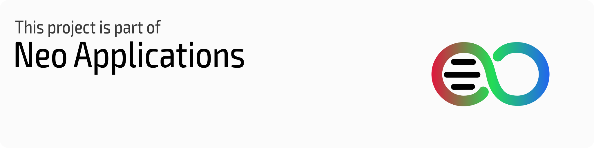

# Neo Backup  

Neo Backup (formerly OAndBackupX) is a fork of the famous OAndBackup with the aim to bring OAndBackup to 202X and part of Neo Applications suite. For now the app is already fully rewritten, coming up would be making it robust and adding some lengthily planned features which could ease the backup/restore workflow with any device. Therefore all types of contribution are always welcome.

Now on functionality of our App:

* It requires root and allows you to backup individual apps and their data.
* Both backup and restore of individual programs one at a time and batch backup and restore of multiple programs are supported.
* Restoring system apps should be possible without requiring a reboot afterwards.
* Backups can be scheduled with no limit on the number of individual schedules and there is the possibility of creating custom lists from the list of installed apps.

And here's the project's [FAQ](FAQ.md).

### A Stance: I stand with Ukraine, as I stood and still stand with Yemen, Syria, Afghanistan, Myanmar, Sudan, Columbia, Somalia, Hong Kong (not China) and everywhere human beings are being oppressed by bigger states and/or local dictatorships.

## Installation

## Recommendation

A combination with your favourite sync solution (e.g. Syncthing, Nextcloud...)  keeping an encrypted copy of your apps and their data on your server or "stable" device could bring a lot of benefits and save you a lot of work while changing ROMs or just cleaning your mobile device.

## Community

You can join either our [Telegram](https://t.me/neo_backup) or [Matrix](https://matrix.to/#/#neo-backup:matrix.org) groups to make suggestions, ask questions, receive news, or just chat.

Our **[Code of Conduct](COC.md)** applies to the communication in the community same as for all contributers.

## Encryption

If enabled the data backup will be encrypted with AES256 based on a password you can set in the settings, which you'll have to use when you want to restore the data. This way you can store your backups more securely, worrying less about their readability.

## Compatibility

Version 5.0.0 uses new encryption, new databases, fixes most of reported bugs in 4.0.0 and boost the performance to something near the 3.2.0's. With that said, it's incompatible with the older versions.

Version 4.0.0 marks a full overhaul of the app structure and thus breaks compatibility with previous versions.

Till the version 0.9.3 there's been no structural change in how the app handles backup/restore. So you could use that version to restore the old backups, then move to the newest version and renew your backups so that they'll stay compatible as long as the logic of the app doesn't radically change.

## Changes & TODOs

#### [Changelog](CHANGELOG.md)  &  [Known Issues](ISSUES.md)

if you have some kotlin and android knowledge and like to contribute to the project, see our Taiga.io project **[here](https://tree.taiga.io/project/machiav3lli-neo-backup/kanban)** to see what is still needed to be done, where a help could be needed or if you'd like to fix one of the issues.

The communication and each contribution in the project community should follow our **[Code of Conduct](COC.md)**.

## Screenshots

 
 
 
 

## Building

OAndBackupX is built with gradle, for that you need the android sdk.

## Licenses 

OAndBackupX is licensed under the [GNU's Affero GPL v3](LICENSE.md).

App's icon is based on an Icon made by [Catalin Fertu](https://www.flaticon.com/authors/catalin-fertu) from [www.flaticon.com](https://www.flaticon.com)

All new icons in 7.0.0 based on CC0 icons found on [SVG Repo](https://www.svgrepo.com). A huge thanks for the project's maintainers.

## Credits

[Jens Stein](https://github.com/jensstein) for his unbelievably valuable work on OAndBackup.

[Nils](https://github.com/Tiefkuehlpizze), [Martin](https://github.com/Smojo) and [DL](https://github.com/dl200010) for their active contribution to the project.

[Oliver Pepperell](https://github.com/opepp) for his contribution to the new anniversary design.

Open-Source libs: [FastAdapter](https://github.com/mikepenz/FastAdapter), [RootBeer](https://github.com/scottyab/rootbeer), [NumberPicker](https://github.com/ShawnLin013/NumberPicker), [Apache Commons](https://commons.apache.org).

### Languages: 

The Translations are now being hosted by [Weblate.org](https://hosted.weblate.org/engage/neo-backup/).

Before that, translations were done analog/offline by those great people:

[Kostas Giapis](https://github.com/tsiflimagas), [Urnyx05](https://github.com/Urnyx05), [Atrate](https://github.com/Atrate), [Tuchit](https://github.com/tuchit), [Linsui](https://github.com/linsui), [scrubjay55](https://github.com/scrubjay55), [Antyradek](https://github.com/Antyradek), [Ninja1998](https://github.com/NiNjA1998), [elea11](https://github.com/elea11).

## Donations

I, myself acknowledge the role of the donations to motivate the work on FOSS projects, but in the state of how dynamic everything around my FOSS-contributions is, I would prefer to not take donations for now (the same answer as the last years). Nevertheless this project wouldn't have the accessibility it has without translations, which you the community drive and for which Weblate provides a platform. That's why I would you suggest you to consider [donating to Weblate](https://weblate.org/donate).

Following the application on their grant for open-source projects, my Tutanota email account got promoted to premium. For that thanks to [Tutanota](https://tutanota.com) for their support!

## Authors

Antonios Hazim & Harald Gutsche
